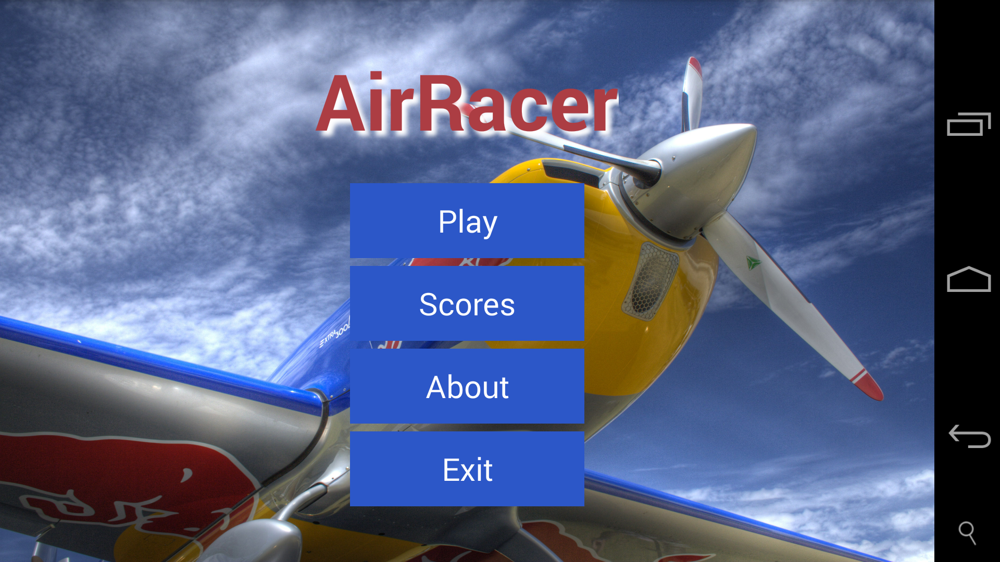
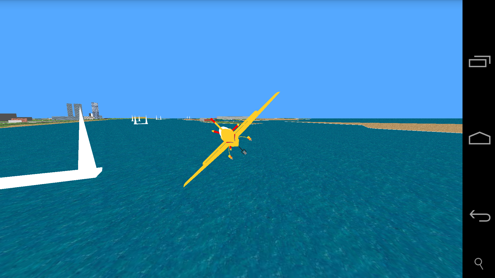
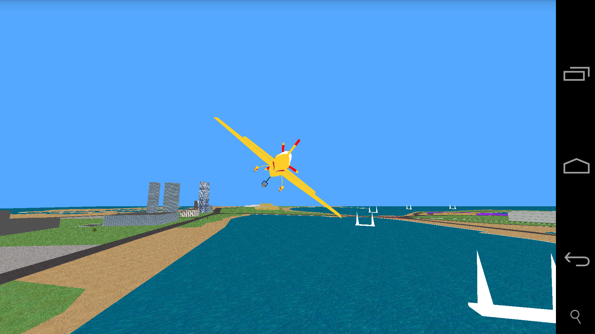
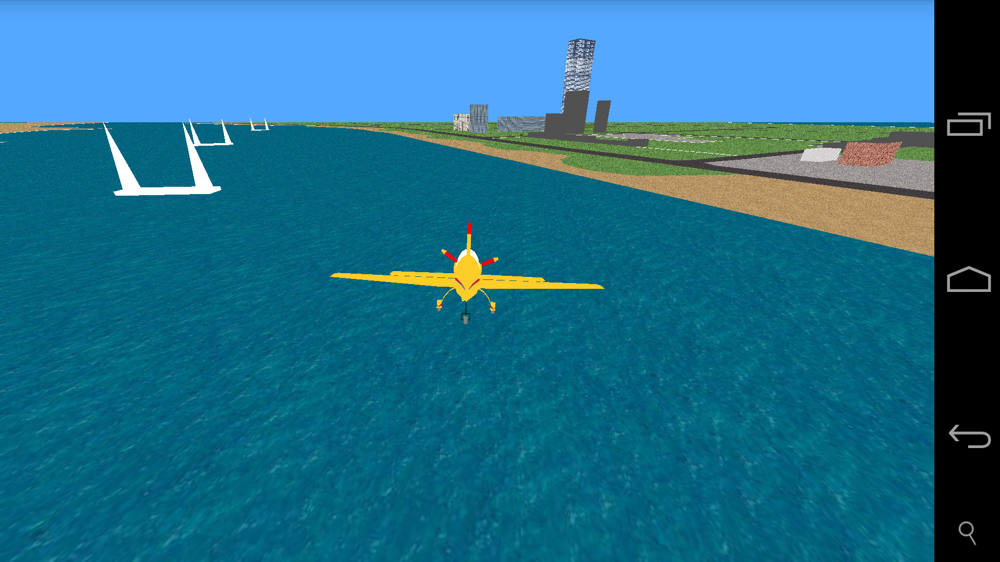

# Air Racer
Air racing is a 3D Android game inspired by Red Bull Air Race. It is written in Java using OpenGL.
The project is created in Android studio IDE.

For some additional informations you can check out the [game design document](docs/AirRacer.pdf) (in Slovene).

Game size: 12.8 MB

#Requirements

* Android Studio IDE
* Android OpenGL enabled device

#Screenshots

